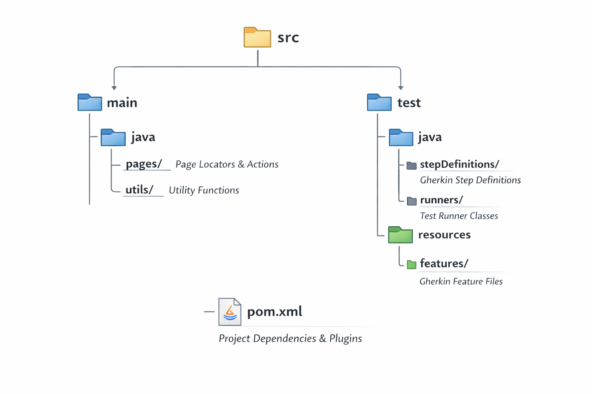

## E-Commerce Automation Testing Framework

Project Overview
This repository contains a robust Behavior-Driven Development (BDD) framework designed to automate end-to-end testing for an E-commerce web application. The project implements the Page Object Model (POM) design pattern to ensure maintainability, reusability, and readability of test scripts.

## 🛠 Tech Stack
* Language: Java (JDK 24)

* Automation Tool: Selenium WebDriver (v4.39.0)

* Test Runner: JUnit / TestNG

* Design Pattern: Page Object Model (POM)

* Methodology: BDD with Cucumber

* Build Tool: Maven

* Reporting: Cucumber HTML Reports / Extent Reports

## 📁 Project Structure

## 🚀 Key Features
* Data-Driven Testing: Utilizing Cucumber Examples to test multiple data sets.

* Explicit Waits: Handled via ElementUtil to manage synchronization issues (prevents TimeoutException).

* Readable Scenarios: Written in plain English using Gherkin syntax for collaboration with non-technical stakeholders.

* Error Handling: Custom utility methods to capture screenshots and logs on failure.

## 🚦 Getting Started

Prerequisites

* Java Development Kit (JDK 24)

* Apache Maven

* Google Chrome (Version 143 or compatible)

* An IDE (IntelliJ IDEA or Eclipse)

Installation & Setup

1. Clone the repository:   git clone https://github.com/DMileexsha/AutomationTestingWebsite.git
2. Navigate to the project folder:  cd AutomationTestingWebsite
3. Install dependencies:  mvn clean install

Running Tests
To execute all test scenarios, run the following command in your terminal:
mvn test

## 📊 Reporting
After the execution is complete, you can find the detailed test reports in: 

target/cucumber-reports/advanced-reports/cucumber-html-reports/overview-features.html

